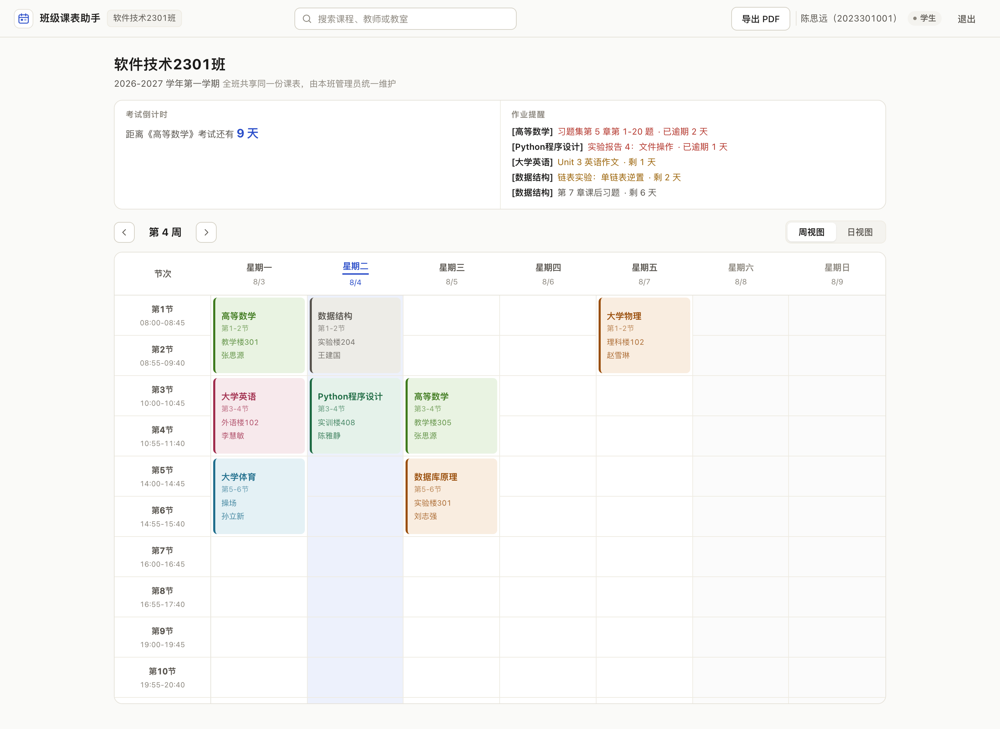
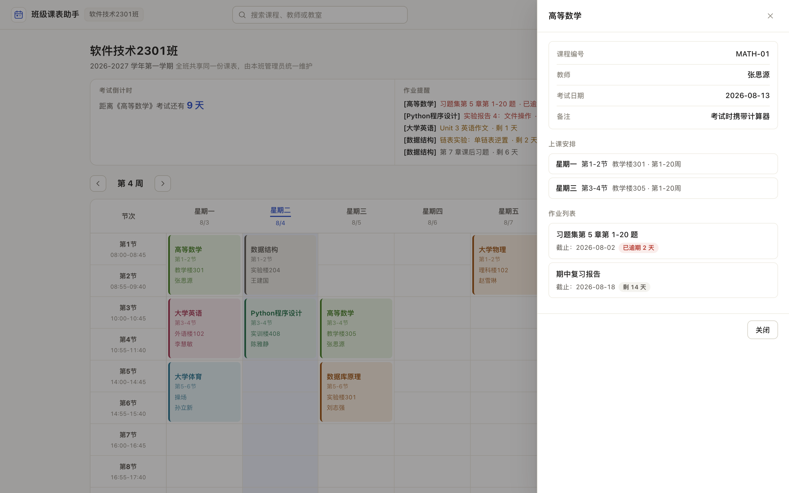
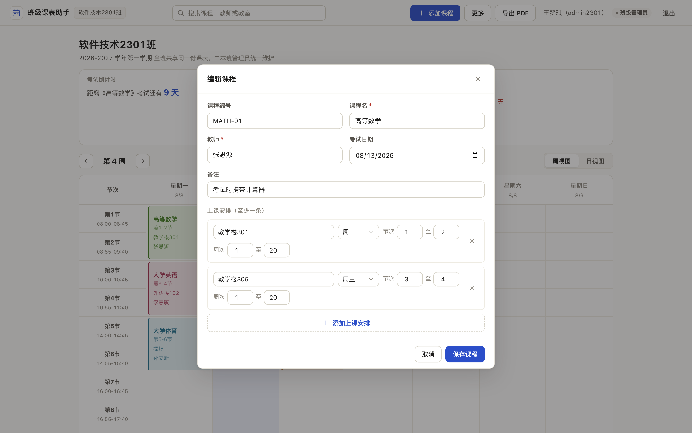
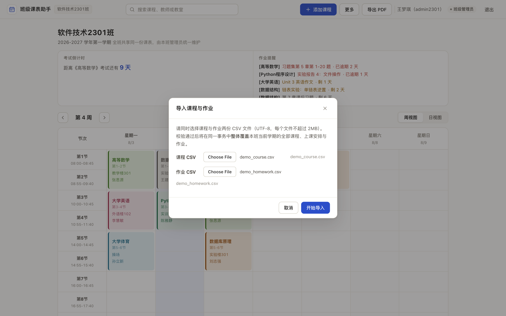
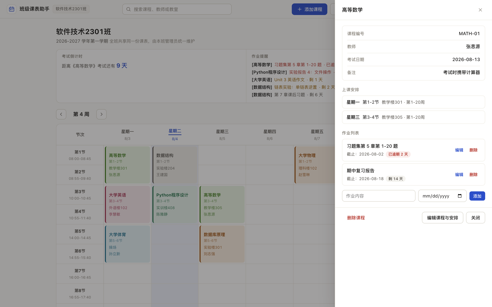
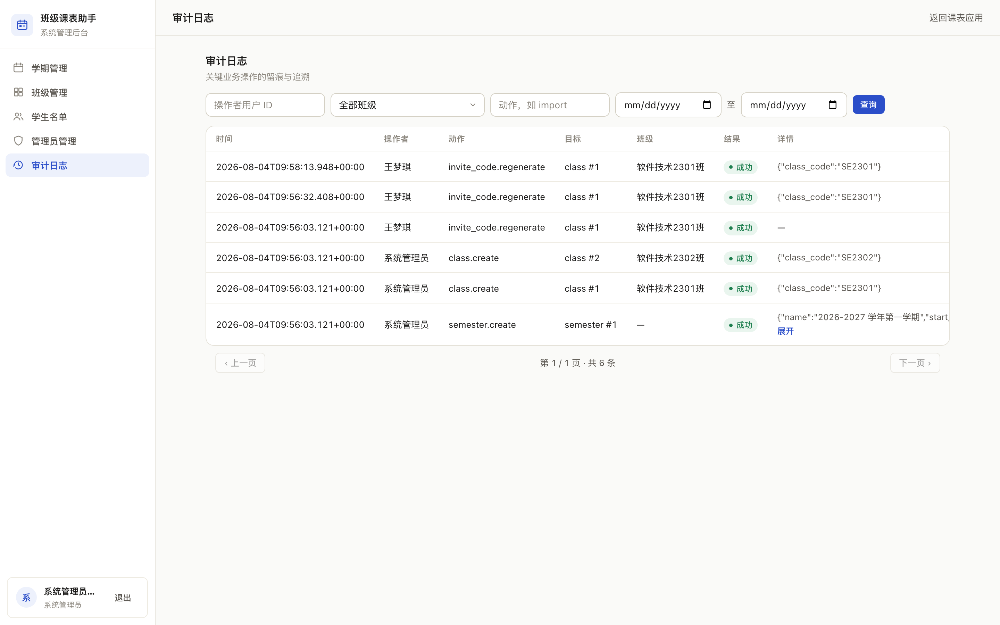
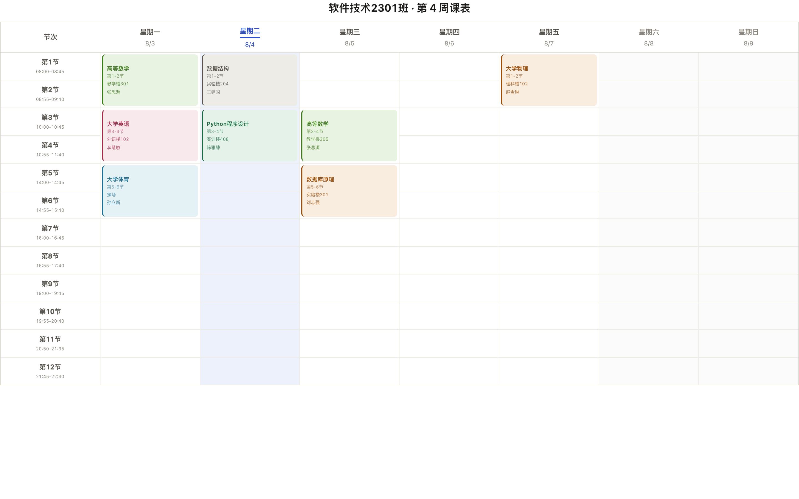
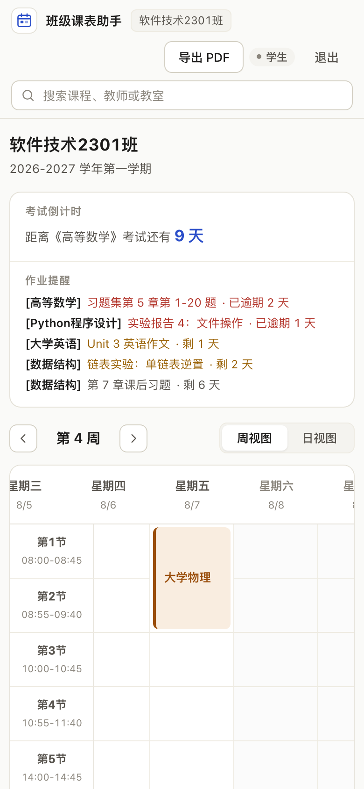

# 班级课表助手项目介绍

| 项目 | 内容 |
|---|---|
| 项目名称 | 班级课表助手 |
| 项目定位 | 面向高校班级的共享课表、作业提醒与班级教学信息管理系统 |
| 技术方案 | Python 3.9+、Flask 3.1、SQLite、原生 HTML/CSS/JavaScript |
| 用户角色 | 学生、班级管理员、系统管理员 |
| 当前状态 | 正式系统已完成本地验收，生产部署与恢复演练待完成 |
| 文档版本 | v1.0，2026-08-08 |

## 一、产品介绍

班级课表助手用于解决高校班级课表分散、作业通知容易遗漏、课程调整难以同步等问题。
系统以“一个班级共享一套课程与作业数据”为核心，由班级管理员统一维护，学生登录后
查看本班课表、作业和考试信息。系统管理员负责学期、班级、学生名单及账号生命周期，
避免学生自由选择班级造成数据混乱。

系统采用三角色权限模型：

- **学生**：通过姓名、学号、班级邀请码和新密码激活预置账号；可查看本班课表、课程
  详情、作业和考试信息，但不能修改班级共享数据。
- **班级管理员**：维护本班当前学期的课程、上课安排和作业，执行双 CSV 导入，管理
  本班邀请码；不能访问或修改其他班级的数据。
- **系统管理员**：建立学期和班级，导入待激活学生名单，任命或交接班级管理员，处理
  账号停用、转班和密码重置，并查看审计日志。

班级和学期范围均由服务端根据 Session 与数据库状态确定，前端不能通过提交
`class_id`、`semester_id` 或角色字段扩大访问范围。SQLite 是正式系统唯一权威业务
数据源，浏览器本地存储不保存账号、权限、课程或作业数据。

## 二、核心功能

### 2.1 学生端

| 功能 | 说明 |
|---|---|
| 学生账号激活 | 学生必须匹配系统预置的姓名、学号和班级，再使用有效邀请码设置密码 |
| 周视图与日视图 | 按当前学期和周次展示本班课程，支持一周总览和单日查看 |
| 课程详情 | 查看课程名称、教师、教室、全部上课安排、考试日期、备注和班级作业 |
| 课程搜索 | 按课程名称或教师快速筛选，完整信息仍可在课程详情中查看 |
| 作业提醒 | 展示作业截止日期，并区分逾期、临近截止等状态 |
| 考试倒计时 | 根据课程考试日期显示最近考试及剩余天数 |
| PDF 导出 | 调用浏览器打印，将当前班级、当前周的完整横向课表保存为 PDF |

### 2.2 班级管理员端

| 功能 | 说明 |
|---|---|
| 课程管理 | 新增、修改和删除课程基本信息 |
| 多时段排课 | 一门课程可配置多条上课安排，避免重复建立同一课程 |
| 冲突检测 | 服务端检查同班、同学期、同星期、节次和周次重叠，冲突时返回 HTTP 409 |
| 班级作业管理 | 新增、编辑和删除全班共享作业，学生保持只读 |
| 双 CSV 导入 | 同时导入`课程.csv`和`作业.csv`，全部校验成功后在一个事务中覆盖 |
| 动态邀请码 | 使用密码学安全随机数生成；数据库只保存摘要，重新生成后旧码立即失效 |

### 2.3 系统管理员端

| 功能 | 说明 |
|---|---|
| 学期管理 | 建立学期、配置第一周周一和总周数，同一时刻只允许一个进行中学期 |
| 班级管理 | 建立和停用班级，维护班级与当前学期关系 |
| 学生名单 | 批量导入待激活学生，保证学号全局唯一 |
| 管理员任命与交接 | 每班只允许一个有效班级管理员，交接后旧管理员立即失权 |
| 账号生命周期 | 停用、启用、转班及密码重置 |
| 审计日志 | 按操作者、班级、动作和日期查询关键管理操作 |

## 三、应用场景

### 场景一：新学期班级初始化

系统管理员建立学期和班级，导入辅导员确认的学生名单，再为每个班级任命班级管理员。
学生使用名单中的身份信息和班级邀请码激活账号，无须自行选择班级。

### 场景二：班级统一维护课表

班级管理员录入课程及多条上课安排。保存时由服务端检查时间冲突，避免同一班级在相同
周次、星期和节次出现课程重叠。学生登录后立即看到统一数据。

### 场景三：批量导入课程与作业

班级管理员同时上传`课程.csv`和`作业.csv`。系统先完整校验表头、字段、课程编号引用、
日期、周次、节次及时间冲突；任一文件或任一行错误时不修改原数据，全部正确后才在
一个数据库事务中完成覆盖。

### 场景四：日常作业与考试提醒

班级管理员发布班级共享作业并维护考试日期。学生可在课表首页查看临近截止、逾期作业
和考试倒计时，减少依赖聊天记录或口头通知。

### 场景五：班级管理员交接

系统管理员执行管理员交接，新管理员获得本班管理权限，旧管理员立即停用；课程、作业
和班级数据仍归属于班级，不因人员变更而丢失。

### 场景六：课表归档与打印

学生或班级管理员切换到目标周后导出完整横向课表。页面搜索状态不会影响打印内容，可
通过浏览器“另存为 PDF”完成提交或线下使用。

## 四、产品亮点

1. **班级共享与严格隔离**：课程和作业由班级管理员统一维护，学生只读；服务端按
   Session 强制限定班级和学期范围。
2. **课程与上课安排分离**：`courses`保存课程信息，`course_sessions`保存多条时段，
   支持同一课程一周多次上课。
3. **双文件原子导入**：课程和作业文件统一校验、统一提交，任何错误都会整体回滚。
4. **动态邀请码与名单激活**：学生不能自由注册；邀请码只存摘要，可随时重置旧码。
5. **服务端冲突检测**：新增和修改课程时检查节次与周次区间重叠，返回可读冲突详情。
6. **关键操作可追溯**：管理员交接、账号管理、课程变更、导入等操作进入审计日志，
   且日志不保存密码、邀请码或 CSRF 令牌明文。
7. **多端展示与 PDF 输出**：支持周视图、日视图、移动端横向浏览和完整课表打印。
8. **可验证的质量基线**：数据库、认证、业务和系统管理共70项自动化测试通过，并完成
   三角色本地浏览器验收。

## 五、产品亮点截图

### 5.1 学生周课表

课程以网格形式显示，顶部集成考试倒计时、作业提醒、周次切换和搜索。

### 5.2 课程完整详情

学生可查看课程基本信息、全部上课安排和班级共享作业，信息不做省略。

### 5.3 一门课程配置多条上课安排

班级管理员在同一课程中维护多个时段，保存时由服务端统一执行冲突检测。

### 5.4 双 CSV 事务导入

课程文件和作业文件必须同时选择，界面展示覆盖提醒、上传状态和逐行错误。

### 5.5 班级作业管理

班级管理员维护共享作业，学生端同步查看截止日期和提醒状态。

### 5.6 系统审计日志

系统管理员可以查询操作者、目标、动作、班级、结果和时间。

### 5.7 横向课表打印

打印时恢复完整周视图并适配横向页面，可通过浏览器保存为 PDF。

### 5.8 移动端适配

系统支持360px以上移动视口，页面主体不横向溢出，课表区域可独立横向浏览。

相关文档：

- [PRD产品需求文档](01_需求与设计/PRD产品需求文档.md)
- [项目需求搜集清单](01_需求与设计/项目需求搜集清单.md)
- [技术架构说明书](01_需求与设计/技术架构说明书.md)
- [任务实施计划](01_需求与设计/tasks.md)
- [测试报告](03_测试验收/测试报告.md)
- [审查报告](03_测试验收/审查报告.md)
- [使用手册](02_使用与交付/使用手册.md)
